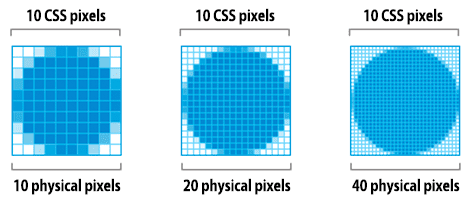
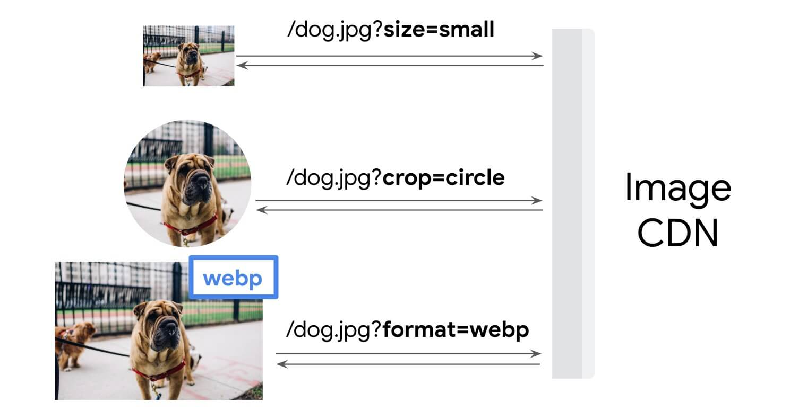

## Web.dev Article

### Choose the correct level of compression

- **The difference between CSS pixels and device pixels**

  

  <br/>

- **Do you need animation? Use `<video>` elements.**

  - GIF limits the color palette to at most 256 colors, and creates significantly larger file sizes than `<video>` elements.

  - There are a number of ways to convert GIFs to video, [FFmpeg](https://www.ffmpeg.org/) is the tool used in this guide. ([Web.dev - Replace Animated GIFs with Video](https://web.dev/articles/replace-gifs-with-videos))

    ```html
    <video autoplay loop muted playsinline>
     <source src="my-animation.webm" type="video/webm" />
     <source src="my-animation.mp4" type="video/mp4" />
    </video>
    ```

- **Do you need to preserve fine detail with highest resolution? Use PNG or lossless WebP.**

  - WebP has a lossless encoding mode that may be more efficient than PNG.

  - If the image asset contains imagery composed of geometric shapes, consider converting it to a vector (SVG) format!

- **Are you optimizing a photo, screenshot, or a similar image asset? Use JPEG, lossy WebP, or lossy AVIF.**

  - JPEG uses a combination of lossy and lossless optimization to reduce filesize of the image asset.

  - Lossy WebP or lossy AVIF may be acceptable JPEG alternatives, but be aware that WebP's lossy mode in particular discards some chroma information to achieve smaller images.

### Choose the correct level of compression

- **Use compression tools**
  - [Imagemin](https://www.npmjs.com/package/imagemin) to compress images. Read more at [Use Imagemin to compress images](https://web.dev/articles/use-imagemin-to-compress-images)

### Serve responsive images

- **Resize images**

  - Two of the most popular image resizing tools are the [sharp npm package](https://www.npmjs.com/package/sharp) and the [ImageMagick](https://imagemagick.org/index.php) command-line tool.

- **Serve multiple image versions**
  ```html
  
  ```
- **Verify**
  - Use [Lighthouse](https://developers.google.com/web/tools/lighthouse). Run the Lighthouse Performance Audit (`Lighthouse > Options > Performance`) and look for the results of the **Properly size images** audit.

### Serve images with correct dimensions

- **Identify incorrectly sized images**
  - Use [Lighthouse](https://developers.google.com/web/tools/lighthouse) to identify incorrectly sized images. Run the Performance Audit (`Lighthouse > Options > Performance`) and look for the results of the Properly size images audit.
- **Determine the correct image size**

  - Use the [Network panel](https://developers.google.com/web/tools/chrome-devtools/network) in Chrome DevTools to determine the correct image size.

    ```html
    <!-- Use the specified width and height -->
    
    ```

    ```css
    /* Or, alternatively use aspect-ratio */
    img {
     aspect-ratio: 16 / 9;
     width: 100%;
     object-fit: cover;
    }
    ```

### Use WebP images

- YouTube found that switching to WebP thumbnails resulted in 10% faster page loads.
- Facebook experienced a 25-35% filesize savings for JPEGs and an 80% filesize savings for PNGs when they switched to using WebP.

### Use image CDNs to optimize images

- **Image CDNs**

  - [Cloudinary](https://cloudinary.com/)
  - [Imgix](https://www.imgix.com/)

  
  

## Online Tool

Use a tool and specify a level compression under 85.

- WebP, JPEG and PNG compression - https://tinyjpg.com/
- Image Optimizer - https://kraken.io/web-interface
- Image Compression - https://compressor.io/
- Website Image Analysis - https://webspeedtest.cloudinary.com/
- Website Image Speed Test - https://imageengine.io/test-my-site/
- SVG Optimization - https://jakearchibald.github.io/svgomg/

## Lazy Loading Images

It is not recommended to use lazy loading for images that are visible in the viewport when the page loads.

`1.` Custom Lazy Loading

```html


```

```css
img {
 background: #f1f1fa;
 width: 400px;
 height: 300px;
 display: block;
 margin: 10px auto;
 border: 0;
}
```

```js
document.addEventListener("DOMContentLoaded", function () {
 var lazyloadImages;

 if ("IntersectionObserver" in window) {
  lazyloadImages = document.querySelectorAll(".lazy");
  var imageObserver = new IntersectionObserver(function (entries, observer) {
   entries.forEach(function (entry) {
    if (entry.isIntersecting) {
     var image = entry.target;
     image.src = image.dataset.src;
     image.classList.remove("lazy");
     imageObserver.unobserve(image);
    }
   });
  });

  lazyloadImages.forEach(function (image) {
   imageObserver.observe(image);
  });
 } else {
  var lazyloadThrottleTimeout;
  lazyloadImages = document.querySelectorAll(".lazy");

  function lazyload() {
   if (lazyloadThrottleTimeout) {
    clearTimeout(lazyloadThrottleTimeout);
   }

   lazyloadThrottleTimeout = setTimeout(function () {
    var scrollTop = window.pageYOffset;
    lazyloadImages.forEach(function (img) {
     if (img.offsetTop < window.innerHeight + scrollTop) {
      img.src = img.dataset.src;
      img.classList.remove("lazy");
     }
    });
    if (lazyloadImages.length == 0) {
     document.removeEventListener("scroll", lazyload);
     window.removeEventListener("resize", lazyload);
     window.removeEventListener("orientationChange", lazyload);
    }
   }, 20);
  }

  document.addEventListener("scroll", lazyload);
  window.addEventListener("resize", lazyload);
  window.addEventListener("orientationChange", lazyload);
 }
});
```

`2.` Native Lazy Loading

```html

<iframe src="example.html" loading="lazy"></iframe>
```

`3.` Image Placeholder

- Dominant color placeholder
- Low quality image placeholder

### Popular Javascript libraries for lazy loading

- Yall.js - https://github.com/malchata/yall.js
- Lazysizes - https://github.com/aFarkas/lazysizes
- Jquery Lazy - http://jquery.eisbehr.de/lazy/

<br/>
<blockquote>
  <b>How to test if lazy loading is working?</b>
  <p style="padding: 5px 0 10px 0">
    Open the <code>Network panel > Images</code> in Chrome DevTools. Here, when you refresh the page for the first time, only the images that are to be loaded up front should get loaded. Then, as you start scrolling down the page, other image load requests would get triggered and loaded.
  </p>
</blockquote>
