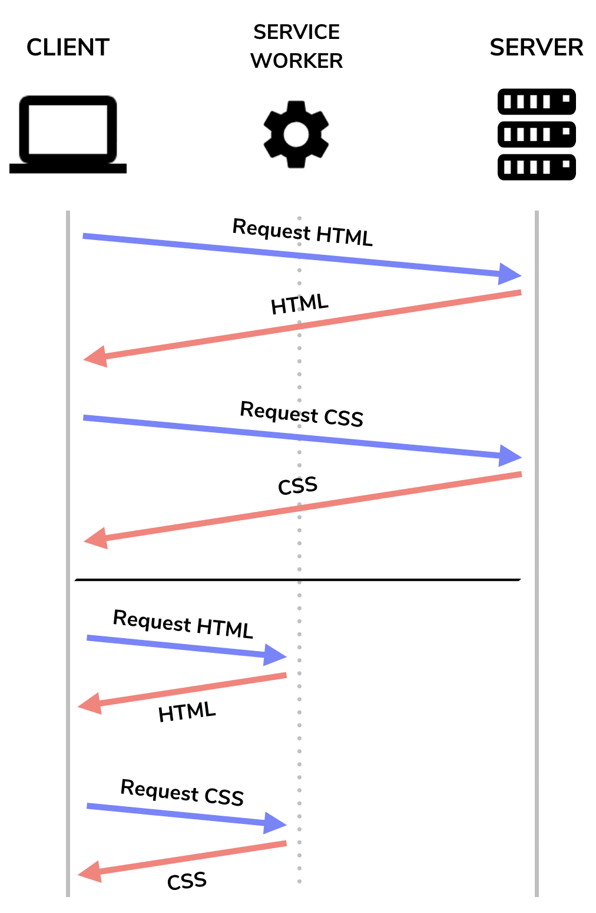

## PRPL Pattern

PRPL is an acronym that describes a pattern used to make web pages load and become interactive, faster:

- **Preload** the late-discovered resources.
- **Render** the initial route as soon as possible.
- **Pre-cache** remaining assets.
- **Lazy load** other routes and non-critical assets.

The PRPL pattern is designed to improve the perceived performance of a web page by reducing the time it takes for the page to become interactive. It is particularly useful for applications that are served over slow or unreliable networks, as it allows the page to render as quickly as possible and then gradually load the remaining resources.

### Preload

Preloading is a way to tell the browser to request a resource before it's needed. This can be done using the `rel="preload"` attribute in the link tag. This is useful for resources that are needed later in the page lifecycle, such as images that are below the fold, or JavaScript that is needed after the page has loaded.

```html
<link rel="preload" href="image.png" as="image" />
<link rel="preload" href="script.js" as="script" />
```

### Render

Start rendering the web page as soon as the critical resources are received, even if some non-critical resources are still being downloaded.

By default, browsers block rendering until all CSS and JS are downloaded and parsed.

Deliver critical JS/CSS inline and defer all non-critical JS/CSS. Critical JS/CSS is an optimization task. It's like telling your browser to load only the JS/CSS being viewed by the visitor.

```html
<!DOCTYPE html>
<html>
 <head>
  <title>Home Page</title>

  <link rel="stylesheet" href="critical.min.css" />
  <link rel="preload" href="non-critical.min.css" as="style" />
  <link rel="stylesheet" href="non-critical.min.css" />
  <script defer src="main.min.js"></script>
 </head>
 <body>
  <h1>Home Page</h1>
  <p>Contents</p>
  

  <script async src="analytics.min.js"></script>
 </body>
</html>
```

```css
/* critical.min.css */
h1 {
 color: red;
}
p {
 color: blue;
}
```

```css
/* non-critical.min.css */
h1:hover {
 color: green;
}
```

```javascript
/* main.min.js (critical scripts) */
console.log("Hello, world!");

window.addEventListener("load", () => {
 console.log("The page has loaded!");
});
```

```javascript
/* analytics.min.js (non-critical) */
setTimeout(() => {
 console.log("This is non-critical analytics");
}, 3000);
```

Or, server-side rendering (SSR) can be used to render the initial route as soon as possible. In this case, the server sends the HTML for the initial route to the client, which can then be rendered immediately, without waiting for any JavaScript to download or execute.

```javascript
// server.js
const http = require("http");
const ReactDOMServer = require("react-dom/server");
const App = require("./App.js");

const server = http.createServer((req, res) => {
 const html = ReactDOMServer.renderToString(<App />);
 res.send(html);
});

server.listen(8000);
```

### Pre-cache

Pre-caching is the process of loading resources that will be needed for future navigations. This can be done using a service worker, which can intercept requests and cache the responses.

Service workers can fetch and cache resources in the background, so that they are available for future navigations.

```javascript
// sw.js
self.addEventListener("install", (event) => {
 event.waitUntil(
  caches.open("v1").then((cache) => {
   return cache.addAll([
    "/",
    "/index.html",
    "/styles.css",
    "/script.js",
    "/image.png",
   ]);
  })
 );
});

self.addEventListener("fetch", (event) => {
 event.respondWith(
  caches.match(event.request).then((response) => {
   return response || fetch(event.request);
  })
 );
});
```

```html
<!DOCTYPE html>
<html>
 <head>
  <title>Home Page</title>
  <link rel="stylesheet" href="styles.css" />
  <script src="script.js"></script>
 </head>
 <body>
  <h1>Home Page</h1>
  <p>Contents</p>
  
  <script>
   if ("serviceWorker" in navigator) {
    navigator.serviceWorker.register("/sw.js");
   }
  </script>
 </body>
</html>
```



### Lazy load

Lazy loading is the process of deferring the loading of non-critical assets until they are needed. This can be done using the `loading="lazy"` attribute on images, or by using JavaScript to load assets on demand.

```html

```

Don't do this:

```javascript
import moduleA from "library";

form.addEventListener("submit", (e) => {
 e.preventDefault();
 someFunction();
});

const someFunction = () => {
 // uses moduleA
 moduleA.doSomething();
};
```

Do this:

```javascript
form.addEventListener("submit", (e) => {
 e.preventDefault();
 import("library").then((moduleA) => {
  someFunction(moduleA);
 });
});
```
