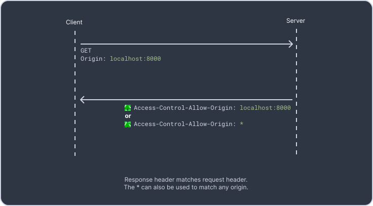
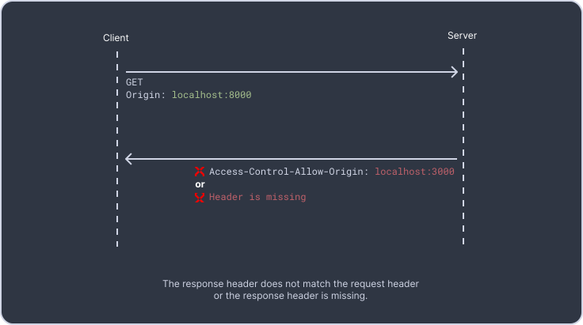
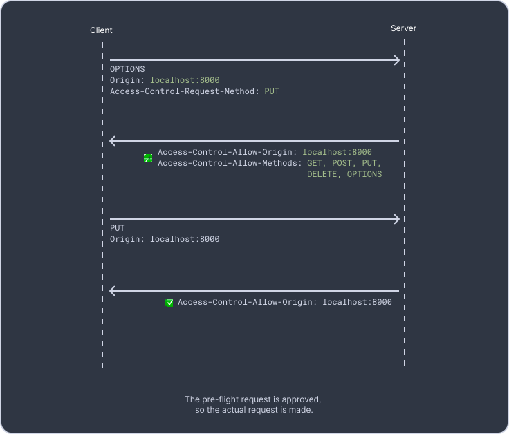
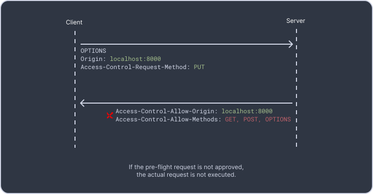

## CORS (Cross-Origin Resource Sharing)

CORS stands for Cross-Origin Request Sharing, and it's an HTTP-header based mechanism where servers can tell browsers if other origins are allowed to interact with its resources.

Let's say you are running a website on `localhost:8000`, and when your JavaScript code is loaded, it makes a request to the server running on `localhost:9000`. You may be surprised to find out that your request has failed. This is because browsers follow the <ins>same-origin policy</ins> and restrict how a document or script, loaded by one origin, can interact with a resource from another origin:

- Requests to a server in the same origin are allowed by the browser.
- Requests to a different origin (known as cross-origin requests) are, by default, blocked by the browser and a CORS error occurs.

<br/>





### How to fix CORS errors?
In server-side code, you can set the `Access-Control-Allow-Origin` header to allow requests from a different origin. This header can be set to a specific origin, or to `*` to allow requests from any origin.
```javascript
var express = require("express");
var cors = require("cors");
var app = express();

// Use the cors middleware
app.use(
 cors({
  origin: "http://localhost:8000",
 })
);

app.get("/api", function (req, res, next) {
 res.json({ msg: "success" });
});

app.listen(9000, function () {
 console.log("CORS-enabled for localhost:8000");
});
```
